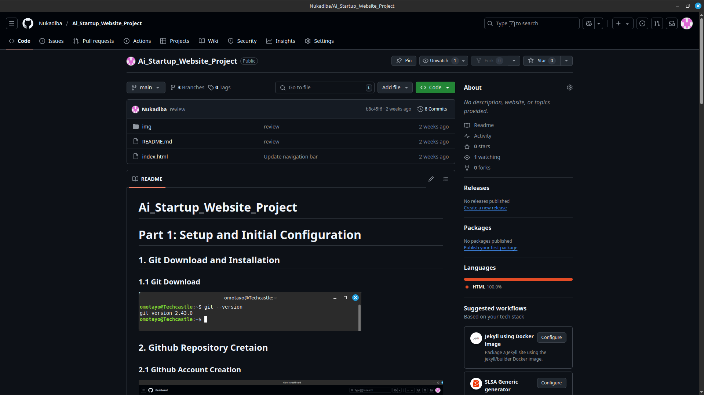
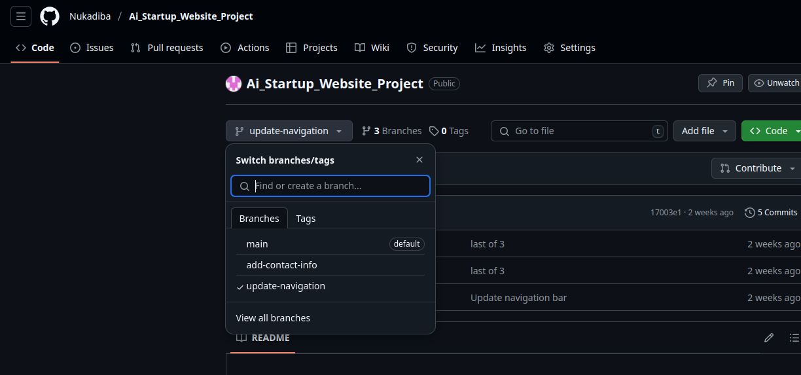
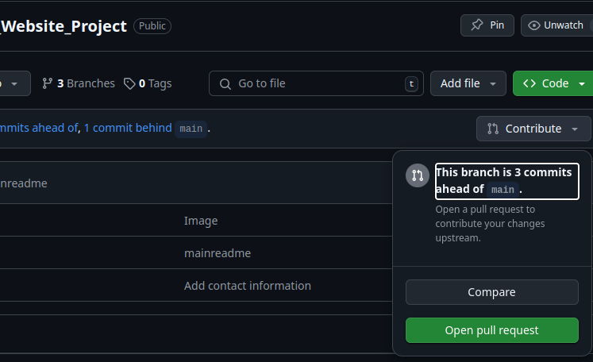
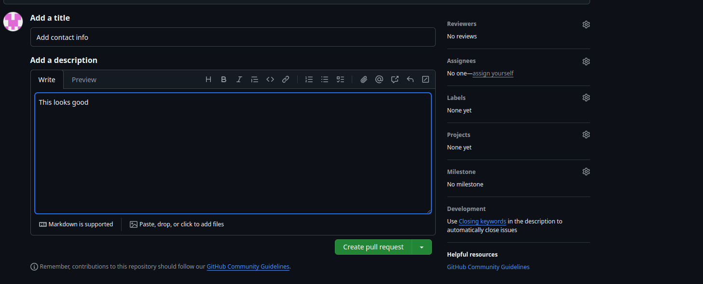
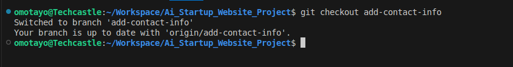

# 1. Git Repository Dashboard

# 2. Switching to update navigation Branch

# 3. Creating a new Pull request 

# 4. Creating the pull request 

# 5. Swicting to add-contact-info branch 

# 6. git pull Origin Main 

# 7. Finalizing Jerry's Contribution 

