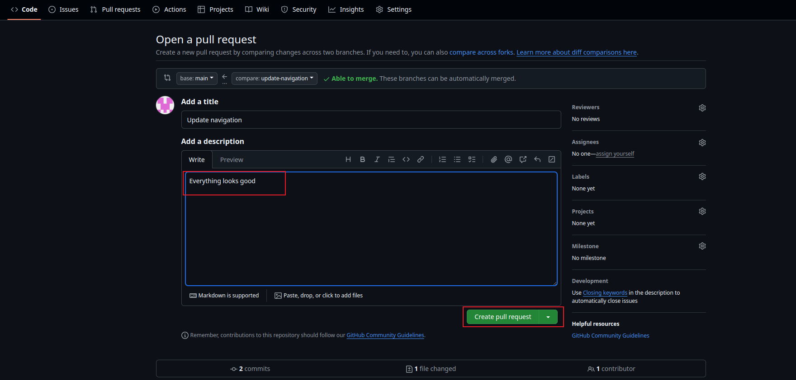

# 1. Navigating into the GitHub Repository

# 2. Switching to the Branch 

# 3. Creating a pull request 

# 4&5. Reviewing Tom Changes and creating the pull request

# Updating Jerry Branch With latest changes

## Switching to Jerry branch 

## Pulling the Latest Change from the Main Branch (Jerry Pull request)

## Finalizing Jerry's Work

